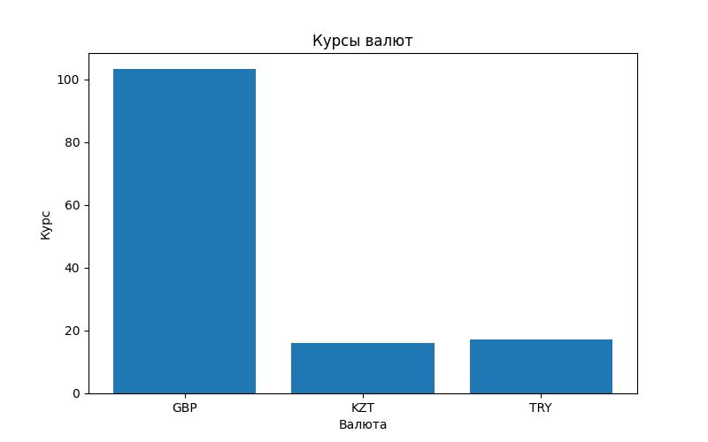

# Лабораторная работа: Работа с валютами. Шаблон «Одиночка»

## Цель работы
Изучить работу с API, XML-данными, а также реализовать шаблон проектирования **Singleton (Одиночка)** с использованием метаклассов в Python.

---

## Задачи

В ходе выполнения лабораторной работы были решены следующие задачи:

- Получение курсов валют с сайта ЦБ РФ  
- Парсинг XML-данных  
- Реализация паттерна Singleton через метакласс  
- Разделение числа с плавающей точкой на целую и дробную части  
- Ограничение частоты запросов к серверу  
- Обработка некорректных ID валют  
- Построение графика курсов валют  
- Написание тестов  

---

## Структура проекта
project:
- main.py
- currency_singleton.py
- tests.py
- currencies.jpg
- README.md

---

## Описание реализации

### Получение данных

Данные о курсах валют получаются с сайта ЦБ РФ:

http://www.cbr.ru/scripts/XML_daily.asp

Используется библиотека `requests` и модуль `xml.etree.ElementTree`.

---

### Singleton (Одиночка)

Реализован через метакласс:

- Создается только один объект класса  
- При повторном создании возвращается уже существующий объект  

---

### Хранение чисел

Числа с плавающей точкой хранятся в виде:
('113', '2069')

Это позволяет избежать проблем с точностью float.

---

### Ограничение запросов

Добавлена защита:

- По умолчанию запрос можно делать не чаще 1 раза в секунду  
- При частом вызове выводится сообщение  

---

### Формат результата

Пример результата:
[{'GBP': ('Фунт стерлингов', ('103', '2585'))}, {'KZT': ('Тенге', ('16', '0419'))}, {'TRY': ('Турецких лир', ('17', '2776'))}]
Объект CurrencySingleton удален

---

### Визуализация

Реализован метод:
visualize_currencies()

Он:

- Строит столбчатый график  
- Сохраняет его в файл: **currencies.jpg**  

---

## Пример графика

---

## Тестирование

Реализованы тесты:

- Проверка некорректного ID  
- Проверка корректного ID (название и диапазон значений)  

Запуск тестов:
python tests.py

---

## Запуск программы
python main.py

---

## Вывод

В ходе выполнения лабораторной работы:

- Освоен паттерн Singleton  
- Получен опыт работы с XML  
- Реализована работа с API  
- Изучены особенности хранения чисел с плавающей точкой в Python  
